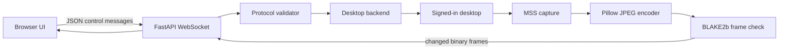

# Architecture and Algorithms

## System model

GUI Remote Controll is a bitmap remote-control system. It does not mirror a native window tree
or expose remote DOM elements. The server captures desktop pixels, encodes them as JPEG, and
injects validated browser input into the signed-in operating-system session.



## Package layout

| Module | Responsibility |
| --- | --- |
| `gui_remote_controll.__main__` | CLI parsing, validation, elevation, browser opening, and Uvicorn startup. |
| `gui_remote_controll.config` | Validated runtime settings and protocol size limits. |
| `gui_remote_controll.auth` | PIN comparison, signed Cookie tokens, and login attempt limiting. |
| `gui_remote_controll.protocol` | Strict normalization and validation of client JSON messages. |
| `gui_remote_controll.desktop` | Screen enumeration/capture, JPEG encoding, input injection, clipboard, DPI, and platform diagnostics. |
| `gui_remote_controll.app` | HTTP routes, security headers, backend lifecycle, connection gate, and WebSocket loops. |
| `gui_remote_controll.static` | Packaged browser UI with no CDN or runtime frontend dependency. |

## Process lifecycle

1. Parse arguments and validate the TLS file pair.
2. Unless disabled or already attempted, relaunch through `py-admin-launch`.
3. Convert parsed values to `Settings` and validate ranges.
4. Create the FastAPI application and Uvicorn server.
5. Serve the login UI, control UI, health endpoint, and static files without opening the desktop.
6. On the first accepted WebSocket, initialize the shared desktop backend in a worker thread.
7. Enumerate displays and start one receive loop and one capture loop for the client.
8. Cancel the peer loop and release held inputs when either loop finishes.

Lazy desktop initialization keeps CLI help, health checks, packaging, and PIN authentication
usable even when the process is temporarily outside a graphical session.

## Elevation algorithm

The public CLI implements a single-relaunch invariant:

```text
if no_elevate or elevation_attempted:
    start server
else:
    launch([python, -m, gui_remote_controll,
            --elevation-attempted, *original_arguments], wait=True)
    exit parent
```

The marker is inserted by the program rather than stored in process environment, so it survives
the platform launcher without requiring environment mutation support. Even when the first
process is already administrator/root, `py-admin-launch` directly launches the marked child and
the invariant remains at most one launch call.

## Authentication algorithm

### PIN comparison

PIN values are compared with `hmac.compare_digest` over UTF-8 bytes. This avoids ordinary
short-circuit string comparison behavior.

### Cookie token

At application creation, the server generates a random 32-byte secret. With a configured PIN:

```text
token = HMAC-SHA256(process_secret, pin_utf8)
```

The hexadecimal token is stored in `gui_remote_auth` with:

- `HttpOnly` enabled;
- `SameSite=Strict`;
- path `/`;
- a maximum age of seven days;
- `Secure` enabled when direct TLS is configured.

The secret is never persisted, so all authentication cookies become invalid after restart.
Without a configured PIN, request and WebSocket authentication checks allow access.

### Failed-login limiter

Failures are stored in an in-memory deque per client IP. Before each attempt, timestamps at or
before `now - 60 seconds` are discarded. A client with five remaining timestamps is rejected
until one expires. Successful authentication clears that client's deque.

This is a process-local rolling-window defense, not a replacement for firewall or proxy rate
limiting on an internet-facing deployment.

## HTTP security boundary

Every HTTP response receives:

- a Content Security Policy restricted to packaged same-origin resources plus WebSocket
  connections and blob/data images;
- `Cross-Origin-Opener-Policy: same-origin`;
- `Referrer-Policy: no-referrer`;
- `X-Content-Type-Options: nosniff`;
- `X-Frame-Options: DENY`.

The main and authentication pages use `Cache-Control: no-store`. Static file access uses a fixed
filename allowlist rather than arbitrary path resolution.

Authentication redirect targets must start with one `/`, must not start with `//`, and are
truncated to 2,048 characters.

## WebSocket admission

Admission checks run before the socket is accepted:

1. Validate the PIN Cookie, closing with `4401` on failure.
2. Validate Origin, closing with `4403` on failure.
3. Reserve a connection slot, closing with `4429` when full.
4. Accept the socket.
5. Initialize the desktop and close with `4500` if it is unavailable.

An absent Origin is allowed for non-browser clients. A browser Origin is accepted when its
network location matches the HTTP Host header or when the complete normalized origin appears in
the configured trusted-origin set.

## Connection and concurrency model

`BackendManager` creates one desktop backend per FastAPI application and protects creation with
an `asyncio.Lock`. Blocking desktop operations run through `asyncio.to_thread`, so capture,
clipboard, and native input calls do not block the event loop.

Each accepted client has:

- one `ClientState` with its display selection and held keys/buttons;
- one frame streaming task;
- one message receiving task;
- one lock serializing JSON and binary WebSocket sends.

The first completed task cancels the other. Cleanup decrements the connection counter and asks
the backend to release all inputs still held by that client.

## Display model

MSS returns an ordered monitor collection:

- monitor `0` is the bounding rectangle of all monitors;
- monitor `N > 0` is a physical display.

A `Screen` contains `index`, `left`, `top`, `width`, `height`, and `name`. Negative `left` or
`top` values are valid when a monitor is positioned to the left or above the primary display.

On Windows, per-monitor DPI awareness is requested before importing input libraries. MSS is
imported before `pynput` to keep capture and input coordinate systems aligned.

## Capture and frame algorithm

The capture loop runs once per WebSocket:

1. Select the current monitor from the client's state.
2. Acquire BGRA pixels through a thread-local MSS instance.
3. Convert MSS RGB bytes to a Pillow RGB image.
4. Encode JPEG with the configured quality and chroma subsampling.
5. Compute `BLAKE2b(frame_bytes, digest_size=8)`.
6. Send display metadata when the selected monitor changes.
7. Send the JPEG as a binary WebSocket message only when its digest differs from the last sent
   frame.
8. Sleep for `max(0.001, 1/fps - capture_elapsed)`.

Hashing encoded bytes means the comparison reflects exactly what the client would receive. The
64-bit digest is used as a fast change detector rather than a security primitive. A theoretical
collision would skip one changed frame; a later differing frame would resume transmission.

Thread-local MSS instances avoid sharing a platform capture object across worker threads. The
instance remains associated with that worker thread for reuse.

## Pointer coordinate mapping

The browser measures the rendered image rectangle and converts a pointer event into normalized
coordinates:

```text
nx = clamp((client_x - image_left) / image_width,  0, 1)
ny = clamp((client_y - image_top)  / image_height, 0, 1)
```

The server converts them to absolute desktop coordinates:

```text
x = screen.left + round(nx * max(0, screen.width  - 1))
y = screen.top  + round(ny * max(0, screen.height - 1))
```

Using normalized values makes Fit and 1:1 modes equivalent and supports negative multi-monitor
origins. Subtracting one keeps `1.0` inside the final pixel rather than one pixel beyond the
display.

## Pointer movement and buttons

The browser sends at most one pending pointer movement per animation frame. Down/up events carry
`left`, `middle`, or `right`. The server first moves the native pointer to the mapped coordinate,
then applies the button operation.

Both browser and server track held buttons. Browser blur, pointer cancellation, WebSocket
disconnect, and server cleanup release them so a lost connection does not leave a native button
pressed.

## Wheel accumulation

Browser deltas are normalized to a bounded range of -20 to 20. The backend keeps two fractional
remainders:

```text
remainder_x -= incoming_dx
remainder_y -= incoming_dy
step_x = trunc(remainder_x)
step_y = trunc(remainder_y)
remainder_x -= step_x
remainder_y -= step_y
```

Only nonzero integer steps are passed to `pynput`. The sign inversion converts browser-positive
down/right deltas to the controller's native convention.

## Keyboard and text algorithms

The browser does not send ordinary printable characters as key events. Instead, a hidden text
input collects regular and composed text and sends it through `text`. Named keys and modified
shortcuts use `key` down/up messages.

This avoids duplicate input from the common sequence of keydown, composition events, and input.
Ctrl/Cmd+V is handled as local pasted text instead of forwarding both a remote shortcut and the
local clipboard contents.

The backend maps browser named keys to `pynput.keyboard.Key` and single characters to
`KeyCode.from_char`. Repeated keydown messages are not injected again. The native operating
system provides repeat behavior while the key remains held.

## Clipboard algorithm

Clipboard get/set operations run in worker threads through `pyperclip`. Text is limited to
1,000,000 characters. A get truncates an unexpectedly longer native clipboard value; the
protocol validator rejects an oversized set before calling the backend.

Clipboard operations are independent of view-only input control. They are completely rejected
only when clipboard synchronization is disabled.

## Client-to-server protocol

All client messages are JSON objects. The maximum encoded message size is 1,100,000 bytes.
Numbers must be finite; booleans are not accepted as numeric values.

| Type | Fields | Meaning |
| --- | --- | --- |
| `pointer` | `event`: `move/down/up`, `x`, `y`, and `button` for down/up | Absolute normalized pointer event. |
| `wheel` | `dx`, `dy` in `[-20, 20]` | Normalized scroll delta. |
| `key` | `event`: `down/up`, `key`, `code`, `repeat` | Named key or modified character event. |
| `text` | `text` | Ordinary or composed text to type. |
| `monitor` | nonnegative integer `index` | Change this connection's captured display. |
| `clipboard_get` | none | Read server clipboard text. |
| `clipboard_set` | `text` | Replace server clipboard text. |
| `ping` | none | Application-level liveness request. |

Unknown types, invalid ranges, excessive strings, NaN, infinity, and malformed JSON produce an
`error` response without terminating the connection.

## Server-to-client protocol

JPEG frames are binary messages. All other messages are JSON.

| Type | Important fields | Meaning |
| --- | --- | --- |
| `hello` | `protocol`, `platform`, `viewOnly`, `clipboard`, `screens`, `monitor` | Initial capabilities and display list. Current protocol is `1`. |
| `screen` | screen fields | Metadata for the binary frames that follow. |
| `clipboard` | `text` | Result of `clipboard_get`. |
| `clipboard_saved` | none | Confirmation of `clipboard_set`. |
| `pong` | none | Response to `ping`. |
| `error` | `message` | Recoverable protocol or desktop operation error. |
| `fatal` | `message` | Desktop capture cannot continue. |

## HTTP route contract

| Route | Authentication | Purpose |
| --- | --- | --- |
| `GET /healthz` | no | Returns `status` and package `version`. |
| `GET /` | PIN Cookie when enabled | Packaged control UI. |
| `GET /auth` | no | Packaged PIN form. |
| `POST /auth` | rate-limited PIN | Sets the authentication Cookie. |
| `POST /logout` | no | Deletes the authentication Cookie. |
| `GET /api/status` | PIN Cookie when enabled | Runtime version, platform, modes, and client counts. |
| `GET /static/{filename}` | no | Serves four allowlisted CSS/JavaScript assets. |
| `WS /ws` | PIN Cookie and Origin | Screen and control protocol. |

## Extension points

`create_app` accepts a desktop backend factory. A replacement backend implements initialize,
screen listing, capture, input execution, input release, and clipboard methods. Tests use this
boundary to run the full HTTP and WebSocket stack without capturing or controlling a real
desktop.
